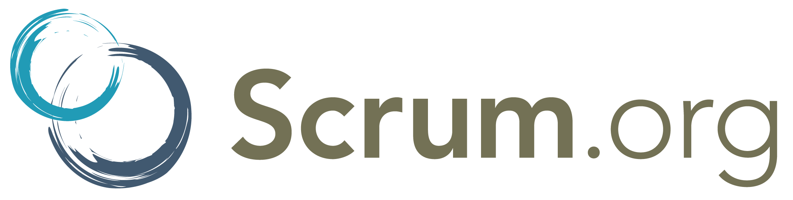

Introduccion
============

¿Que es una Metodologia Agil?
-----------------------------
Lo agil se define como la habilidad de responder de forma varsatil al cambio para maximizar los beneficios. Las metodologias agiles varian en su forma de responder al camibo, pero en general comparten las sigientes caracteristicas:

* Los individuos y sus interacciones son mas importantes que los procesos y las herramientas.

* EL software que funciona es mas imoortante que la documentacion exhaustiva.

¿Que es Scrum?
================

Scrum es un proceso en el que se aplican de manera regular un conjunto de buenas prácticas para trabajar colaborativamente, en equipo, y obtenerel mejor resultado posible de un proyecto. Estas prácticas se apoyan unas a otras y su selección tiene origen en un estudio de la manera de trabajar de equipos altamente productivos.

Scrum es el nombre con el que se denomina a los marcos de desarrollo ágiles caracterizados por:

 * Adoptar una estrategia de desarrollo incremental, en lugar de la planificación y ejecución completa del producto.
 * Basar la calidad del resultado más en el conocimiento tácito de las personas en equipos autoorganizados, que en la calidad de los procesos empleados.
 * Solapamiento de las diferentes fases del desarrollo, en lugar de realizar una tras otra en un ciclo secuencial o de cascada.

Historia
-----------
Este modelo fue identificado y definido por Ikujiro Nonaka e Hirotaka Takeuchi a principios de los 80, al analizar cómo desarrollaban los nuevos productos las principales empresas de manufactura tecnológica.

En su estudio, Nonaka y Takeuchi compararon la nueva forma de trabajo en equipo, con el avance en formación de melé (scrum en inglés) de los jugadores de Rugby, a raíz de lo cual quedó acuñado el término “scrum” para referirse a ella.
	
En 1995 Ken Schwaber presentó “Scrum Development Process” en OOPSLA 95 (Object-Oriented Programming Systems & Applications conference), un marco de reglas para desarrollo de software, basado en los principios de scrum, y que él había empleado en el desarrollo de Delphi, y Jeff Sutherland en su empresa Easel Corporation (compañía que en los macrojuegos de compras y fusiones, se integraría en VMARK, y luego en Informix y finalmente en Ascential Software Corporation)

En la actualidad...
+++++++++++++++++++
En la actualidad, Scrum se está utilizando en diferentes tipos de negocio y, especialmente, en el desarrollo de software. 

Pricipios de la metodologia Scrum 
---------------------------------

* Concentracion 
* Priorizacion 
* Auto-organizacion
* Ritmo

¿Como se usa?
=============
Con la metodología Scrum el cliente se entusiasma y se compromete con el proyecto dado que lo ve crecer parte por parte. Asimismo le permite en cualquier momento realinear el software con los objetivos de negocio de su empresa, ya que puede introducir cambios funcionales o de prioridad en el inicio de cada nueva iteración sin ningún problema.

Esta metódica de trabajo promueve la innovación, motivación y compromiso del equipo que forma parte del proyecto, por lo que los profesionales encuentran un ámbito propicio para desarrollar sus capacidades. 

Beneficios de Scrum
===================

#. El cliente puede empezar a utilizar los resultados más importantes del proyecto antes de que esté finalizado por completo.
#. El cliente establece sus expectativas indicando el valor que le aporta cada requisito
#. Reducción de riesgos
#. Predicciones de tiempos
#. Mayor productividad

Reuniones en Scrum
==================

.. image:: reuniones.jpg
Daily Scrum
-----------

* La reunión comienza puntualmente a su hora.
* Todos los asistentes deben mantenerse de pie.
* La reunión debe ocurrir en la misma ubicación y a la misma hora todos los días.
* Durante la reunión, cada miembro del equipo contesta a tres preguntas:
#. ¿Qué has hecho desde ayer?
#. ¿Qué es lo que estás planeando hacer hoy?
#. ¿Has tenido algún problema que te haya impedido alcanzar tu objetivo?

Reunión de Planificación del Sprint (Sprint Planning Meeting)
-------------------------------------------------------------

* Al inicio del ciclo Sprint (cada 15 o 30 días), una “Reunión de Planificación del Sprint” se lleva a cabo.
* Seleccionar que trabajo se hará
* Ocho horas como límite
* Al final del ciclo Sprint, dos reuniones se llevaran a cabo: la “Reunión de Revisión del Sprint” y la “Retrospectiva del Sprint”

Reunión de Revisión del Sprint (Sprint Review Meeting)
------------------------------------------------------

* Revisar el trabajo que fue completado y no completado.
* Presentar el trabajo a los interesados.
* El trabajo incompleto no puede ser demostrado.
* Cuatro horas como límite

Retrospectiva del Sprint (Sprint Retrospective)
-----------------------------------------------

Después de cada sprint, se lleva a cabo una retrospectiva del sprint, en la cual todos los miembros del equipo dejan sus impresiones sobre el sprint recién superado. El propósito de la retrospectiva es realizar una mejora continua del proceso. Esta reunión tiene un tiempo fijo de cuatro horas.

	
Documentos del Scrum
====================

Product backlog
---------------

El product backlog es un documento de alto nivel para todo el proyecto. Contiene descripciones genéricas de todos los requerimientos, funcionalidades deseables, etc. priorizadas según su valor para el negocio (business value). Es el qué va a ser construido. Es abierto y cualquiera puede modificarlo.

Sprint backlog
--------------

El sprint backlog es un documento detallado donde se describe el cómo el equipo va a implementar los requisitos durante el siguiente sprint. Las tareas se dividen en horas con ninguna tarea de duración superior a 16 horas. Si una tarea es mayor de 16 horas, deberá ser rota en mayor detalle. Las tareas en el sprint backlog nunca son asignadas, son tomadas por los miembros del equipo del modo que les parezca oportuno.

Burn down
---------

La burn down chart es una gráfica mostrada públicamente que mide la cantidad de requisitos en el Backlog del proyecto pendientes al comienzo de cada Sprint. Dibujando una línea que conecte los puntos de todos los Sprints completados, podremos ver el progreso del proyecto. Lo normal es que esta línea sea descendente, hasta llegar al eje horizontal, momento en el cual el proyecto se ha terminado. 

+------------------------+------------------------+
|     **Ventaja**        |    **Desventaja**      |     
+========================+========================+
|* Se trabaja en         |* Es una metodología    |
|interaciones cortas     | que difiere del resto  |
+------------------------+------------------------+

Fuentes
=======
`Wikipedia <http://www.wikipedia.org/>`_

`ProyectosAgiles <http://www.proyectosagiles.org/requisitos-de-scrum>`_

`Metodologia Scrum <http://www.softeng.es/es-es/empresa/metodologias-de-trabajo/metodologia-scrum.html>`_

`Proyectos <http://www.proyectosagiles.org/que-es-scrum>`_

